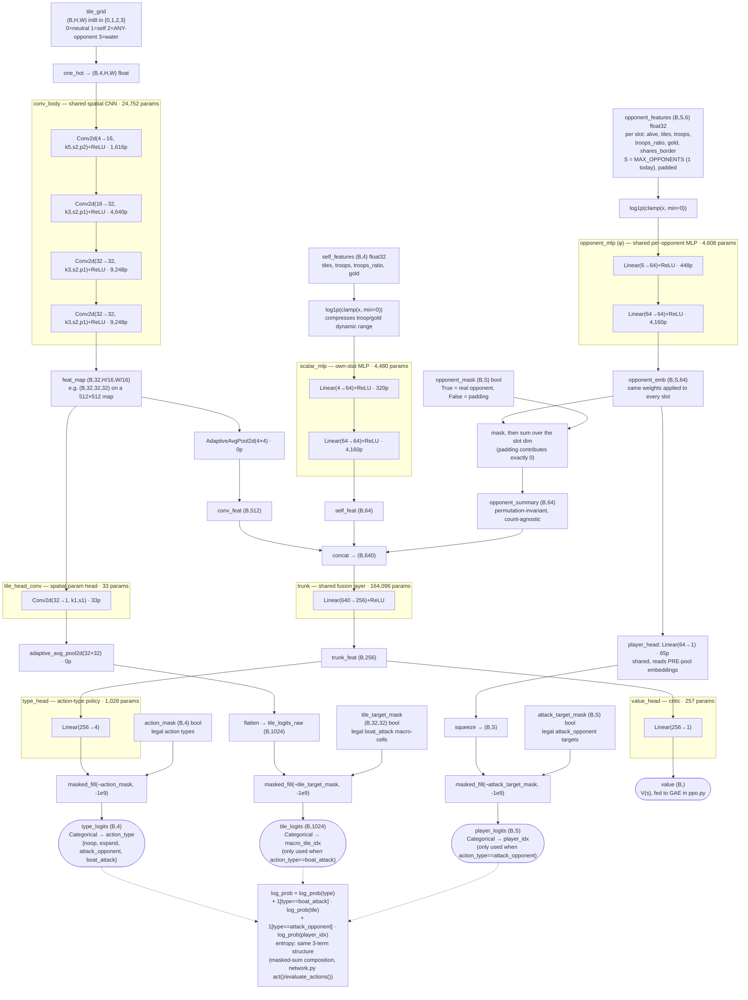

# openfront-rl

Training a deep RL agent to beat OpenFrontIO's hardest built-in AI
("Impossible"-difficulty Nation bot) via self-play, under a tight compute
budget (one local GTX 1660 + free-tier Kaggle GPU/TPU hours).

See `.claude`-generated plan for full design rationale (PPO over
MuZero/EfficientZero, action/observation space, phased milestones).

## Repo layout

- `OpenFrontIO/` — git submodule, pinned to a specific commit of
  [openfrontio/OpenFrontIO](https://github.com/openfrontio/OpenFrontIO). This
  is the actual game simulation being trained against; never edited here.
- `env-bridge/` — TypeScript. Drives the real headless simulation
  (`GameRunner` + `Executor`, the same pipeline the browser client and
  server use) via Node, so an RL agent can control a player through the
  same `Intent` protocol as a human.
  - `src/GameSetup.ts` — shared episode setup (`Episode` class): builds AGENT
    (a controllable Human player) and OPPONENT (a real built-in Nation-AI
    player, `NationExecution`, at a selectable `Difficulty`, drawn from the
    map's real manifest) on a real production map. Construction mirrors
    OpenFrontIO's own `createGameRunner()` step-for-step — real `Config`
    (not a simplified test stand-in), real `GameType.Singleplayer`, real
    player/nation id derivation via `PseudoRandom.nextID()` — so an episode
    reconstructs identically wherever it's loaded (see "Why real
    construction matters" below).
  - `src/runEpisode.ts` — headless smoke test / determinism check, with a
    `--dump-game-record <dir>` flag to write a full `GameRecord`.
  - `src/EnvServer.ts` — long-lived process speaking a newline-JSON
    reset/step protocol over stdin/stdout (see file header for the wire
    format and action space).
  - `src/ReplayServer.ts` — tiny local HTTP server (defaults to port 8787,
    which a plain `npm run dev` client already checks by default) serving
    `GET /game/:id` from a directory of `Episode.toGameRecord()` dumps, so
    an episode can be watched in the real OpenFrontIO browser client — see
    "Watching a game" below.
- `training/` — Python.
  - `envs/openfront_env.py` — `gymnasium.Env` wrapping `EnvServer.ts` over a
    subprocess. Single-agent: AGENT is controlled by `step(action)`;
    OPPONENT (the Nation AI) needs no action, it plays itself.
  - `curriculum.py` — `CurriculumScheduler`: windowed win-rate promotion/
    demotion through Easy → Medium → Hard → Impossible, now driven by real
    training via `train.py`.
  - `smoke_test.py` — full-stack round-trip check using a random
    (legal-action-masked) policy; not the actual training loop.
  - `smoke_test_multiopp.py` — checks the properties that make the opponent
    encoder count-agnostic (one network across 1/5/10 slots, padding
    contributing nothing, permutation invariance, the pointer head never
    targeting a masked-off slot). These can't be covered by training while
    `MAX_OPPONENTS` is 1, since nothing is ever padded or ambiguous then.
  - `models/network.py` — the actor-critic network: a small CNN (strided
    convs + adaptive pooling, so it works across map sizes unchanged) over
    the one-hot tile-ownership grid, concatenated with an MLP over the six
    scalar player-stat features, feeding a shared trunk into masked policy
    and value heads. Deliberately small (a few hundred thousand params) —
    the compute budget is one local GTX 1660 plus occasional Kaggle bursts,
    not a cluster.
  - `envs/vector_env.py` — a minimal synchronous multi-env wrapper (N
    `OpenFrontEnv` instances, auto-resetting on episode end) for more
    diverse rollout data; not yet OS-parallel (see file docstring).
  - `ppo.py` — the PPO algorithm itself: rollout buffer, GAE, clipped
    surrogate update. Plain/textbook, no distributed training.
  - `train.py` — **the actual training loop** (Phase 3): collects rollouts
    against the real Nation-AI opponent, runs PPO updates, feeds episode
    outcomes into `CurriculumScheduler`, checkpoints (resumable — safe to
    stop and restart across, e.g., Kaggle's 12h session cap), and
    periodically runs a greedy eval episode that dumps a real, verifiable
    `GameRecord` of how the current policy actually plays (same
    construction as training — see `GameSetup.ts` — so it's watchable in
    the real client and verifiable via `npm run replay:game`, not an
    approximation of what training saw).
  - `run_bbf_gamma098.sh` — launches (**and resumes**) the current run with
    its hyperparameters pinned. Checkpoints store weights, optimizer state
    and curriculum position but *not* hyperparameters, so a resume that
    forgets a flag does not fail — it silently continues the same checkpoint
    under argparse defaults, flipping `gamma` 0.98→0.99 and rollout 50→64
    mid-run with nothing in the logs to say so. Always resume via the script.
  - `oom_guard.sh`, `notify_on_finish.sh`, `notify_on_download.sh` — ops
    helpers: OOM-victim reordering for the long run, and ntfy alerts.
- `kaggle/` — Kaggle burst-training port: `package_source.sh` builds the
  input Dataset payload, `setup_kaggle.sh` bootstraps a session (clones
  OpenFrontIO at the pinned SHA, `npm ci`, smoke test), and
  `openfront_rl_kaggle.ipynb` is the notebook that chains sessions across
  the 12h cap by pushing `out/` back as a new Dataset version. Runs on CPU
  (`--device cpu`) — see `kaggle/README.md` for why Kaggle is *slower* than
  this box for this workload.
- `analysis/` — one directory per training run, each holding self-contained,
  rerun-safe analyses (a `build_dataset.py` that scrapes the run's own logs
  or replays, a plot script, the generated CSV/PNG, and a README stating what
  the run shows and what the comparison caveats are). Plots of the same kind
  are deliberately built identically across runs — same metric, window, axis
  limits and colors — so they can be compared by eye. See
  `analysis/README.md`.

## Architecture

There is exactly **one** trained neural network in this project:
`ActorCritic` (`training/models/network.py`), a single `nn.Module` with a
shared conv/MLP trunk and four heads (action-type, spatial tile-target,
opponent-pointer, value) that all backprop through that shared trunk
together — not four separately-trained networks. **199,319 trainable
parameters total** (~199K), sized deliberately small for a single local GTX
1660 (6GB) plus occasional Kaggle GPU bursts, not a cluster.

Opponents are encoded as a **set**, not fixed scalars: a shared per-opponent
MLP (`opponent_mlp`, DeepSets' φ) embeds each padded slot, a masked sum-pool
collapses those into one order-independent summary for the trunk, and a
shared pointer head scores each slot for `attack_opponent`'s target. No
weight shape depends on the number of opponents, so the count is a config
value (`MAX_OPPONENTS`), not an architectural commitment. It is **1** today —
the same 1v1 matchup as every run so far — with the count-agnostic
properties covered by `training/smoke_test_multiopp.py` rather than by
training.



### Per-component sizes and hyperparameters

| Component | Type | Shape in → out | Hyperparameters | Params |
|---|---|---|---|---|
| `conv_body` (shared) | 4× `Conv2d`+ReLU | `(B,4,H,W)` → `(B,32,H/16,W/16)` | channels 4→16→32→32→32; kernels 5,3,3,3; stride 2 (all); padding 2,1,1,1 | 24,752 |
| `pool` (trunk path) | `AdaptiveAvgPool2d` | `(B,32,h,w)` → `(B,32,4,4)` | output size 4×4 (fixed, size-invariant to map dims) | 0 |
| `tile_head_conv` | `Conv2d` 1×1 | `(B,32,h,w)` → `(B,1,h,w)` | kernel 1, stride 1 | 33 |
| tile head pooling | `adaptive_avg_pool2d` | `(B,1,h,w)` → `(B,1,32,32)` | output size = `MACRO_GRID`=32 (fixed) | 0 |
| `scalar_mlp` | 2× `Linear`+ReLU | `(B,4)` → `(B,64)` | hidden width 64 (both layers); input pre-transform `log1p(clamp(x,min=0))` | 4,480 |
| `opponent_mlp` (φ) | 2× `Linear`+ReLU | `(B,S,6)` → `(B,S,64)` | hidden width 64; **shared across all S slots** — the weight sharing is what makes the encoder permutation-invariant and count-agnostic | 4,608 |
| opponent pooling | masked sum | `(B,S,64)` → `(B,64)` | padding zeroed via `opponent_mask` before summing; sum (not mean) keeps opponent count recoverable | 0 |
| `player_head` | `Linear` | `(B,S,64)` → `(B,S)` | shared per-slot; reads pre-pool embeddings; masked with `-1e9` on illegal targets | 65 |
| `trunk` | 1× `Linear`+ReLU | `(B,640)` → `(B,256)` | `trunk_dim`=256; input = `conv_feat`(512) ⧺ `self_feat`(64) ⧺ `opponent_summary`(64) | 164,096 |
| `type_head` | `Linear` | `(B,256)` → `(B,4)` | `NUM_ACTIONS`=4; masked with `-1e9` on illegal types | 1,028 |
| `value_head` | `Linear` | `(B,256)` → `(B,1)` | — | 257 |
| **Total** | | | | **199,319** |

Architecture-level constants (`network.py`): `conv_channels=32`,
`trunk_dim=256`, `NUM_TILE_CLASSES=4`, `NUM_SELF_FEATURES=4`,
`NUM_OPPONENT_FEATURES=6`, `NUM_ACTIONS=4`, `MACRO_GRID=32` (the last must
match `EnvServer.ts`/`openfront_env.py`'s constant of the same name, as must
`MAX_OPPONENTS` — which is *not* a network constant precisely because no
weight shape depends on it; `S` is read from the input tensor at runtime).

### Training (PPO) hyperparameters

Not part of the network itself, but every knob governing how it's
trained (`train.py` CLI flags / `ppo.py` defaults; **current live run's
overrides in bold** where they differ from the default):

| Hyperparameter | Default | Current run |
|---|---|---|
| optimizer | `torch.optim.AdamW` | — |
| learning rate (`--lr`) | 3e-4 | 3e-4 |
| weight decay (`--weight-decay`) | 0.0 (≡ plain Adam) | **0.1** (BBF's value — see Status) |
| discount `gamma` (`--gamma`) | 0.99 | **0.98** |
| GAE `lambda` (`--gae-lambda`) | 0.95 | 0.95 |
| PPO clip `epsilon` (`--clip-eps`) | 0.2 | 0.2 |
| value loss coef (`ppo.py`'s `value_coef`) | 0.5 | 0.5 |
| entropy coef (`--entropy-coef`) | 0.02 | 0.02 (lowered from an earlier 0.04 — see Status) |
| max grad norm (`ppo.py`'s `max_grad_norm`) | 0.5 | 0.5 |
| target KL / early-stop (`--target-kl`) | 0.03 (abort epoch loop past 1.5×) | 0.03 |
| PPO epochs per update (`--epochs`) | 4 | **8** |
| minibatch size (`--minibatch-size`) | 128 | 128 |
| parallel envs (`--num-envs`) | 4 | **10** |
| rollout length (`--rollout-length`) | 64 | **50** |
| ticks per decision step (`--ticks-per-step`) | 10 | 10 |
| max episode steps, safety cap (`--max-episode-steps`) | 20,000 | 20,000 |
| curriculum window (`--curriculum-window`) | 12 eval episodes | 12 |
| checkpoint interval (`--checkpoint-every`) | 20 updates | 20 |
| eval interval (`--eval-every`) | 20 updates | **60** |

**`--weight-decay` is decoupled and applies to ≥2D parameters only** (conv
kernels, linear weight matrices), never to biases — biases carry none of the
overfitting risk it targets and shrinking them just drags the logits toward
zero. The network has no normalization layers, so ≥2D vs 1D cleanly separates
weights from biases. At `0.0` the optimizer is bit-identical to the previous
plain Adam, so the flag is a true no-op by default.

**Several of the current run's values are coupled, not independently chosen:**

- `gamma 0.98` ⇔ `rollout-length 50`. One decision step is 1.0s of game time
  (`ticks-per-step 10` × `msPerTick 100`), and gamma's effective horizon is
  `1/(1-0.98) = 50` steps. The rollout is sized to exactly one discount
  horizon — collecting past the point the return stops weighting buys nothing
  for credit assignment.
- `eval-every 60` holds *experience between evals* constant at 3000
  decision-steps per env (60 × rollout 50), matching the earlier runs'
  10 × rollout 300. Eval cost is fixed (one full greedy game) while update
  cost fell 6× with the shorter rollout, so keeping `eval-every 10` would
  have multiplied eval overhead 6×. This is what makes eval index comparable
  across runs in `analysis/`.
- `epochs 8` is BBF's replay ratio; it is paired with the weight decay
  deliberately, since reusing each transition twice as often is what the
  decay is there to offset.

Environment/reward-side constants (`EnvServer.ts`, not network
hyperparameters but still tunable knobs): potential-shaping coefficient
`1.0` (i.e. the tile-share delta is used unscaled), terminal win/loss reward
`±1` (a truncated/drawn episode scores `-1`, same as a loss), `MACRO_GRID`=32,
`MAX_OPPONENTS`=1.

## Upcoming Architecture

Phase 1 of the roadmap (multi-opponent support + the variable-N opponent
encoding it requires) is **built** — its diagram is the live one in
[Architecture](#architecture) above, not a proposal. `MAX_OPPONENTS` is
still 1, so the shipped environment is the same 1v1 matchup as before; what
changed is that neither the wire format nor any weight shape depends on that
number anymore, so raising it is a config change. `attack_opponent` is now
parameterized by `player_idx` (chosen by the pointer head), and the observation
carries `self_troops_ratio` plus a per-opponent `troops_ratio` — the
capped-army signal that a raw troop count cannot express, since the cap is
map- and tile-count-dependent.

Deliberately **not** taken from the roadmap: its proposed sum-of-margins
reward (`(self_tiles - Σ opp_tiles) / total_land_tiles`). The live reward
counts only AGENT's own tile share, which already means the same thing at
any opponent count, so there was nothing to generalize — and changing the
reward in the same step as the architecture would make any regression
un-attributable to either. See `potential()` in `EnvServer.ts`.

Still unbuilt: Phase 2 (building/structure actions, reusing the macro-tile
head as a build-location picker plus a `unit_type` head) and Phase 3
(diplomacy — alliances, donations, embargoes — all `player_idx`-parameterized
and reusing the pointer head above rather than adding new architecture).
Phase 3 is gated on multi-opponent being genuinely exercised, since
diplomacy is close to meaningless against exactly one opponent.
## Why real construction matters (train/deploy fidelity)

Earlier versions of this project used a `TestConfig`-derived config (fast,
deterministic attack attrition — a flat 1 troop lost per side per tick,
regardless of army size or terrain) and a hand-built synthetic opponent
that bypassed the map's real nation list. That was fast to iterate on, but
it meant training happened under game mechanics that barely resembled
production: real `Config.attackLogic()` scales troop loss and conquest
speed with troop density, terrain, relative army size, and outnumbered
ratio — nothing like a flat constant — and real spawn immunity is 50 ticks,
not 0. A policy trained under the fake mechanics would face serious
distributional shift the moment it played a real game.

`Episode` now uses real `Config` and mirrors `createGameRunner()` (the
literal function both live games and the client's own archived-game replay
path use) exactly: same player/nation construction order, same PRNG draw
sequence, same `GameType.Singleplayer` a real solo-vs-AI game uses. This
buys two things at once: training happens under real mechanics, and a
dumped episode is byte-for-byte reproducible by OpenFrontIO's own tooling
and the real client — there's exactly one construction path to keep
faithful, not a fast one and a separate "faithful" one to keep in sync.
Concretely this also means:

- `resolveMap()` now only supports real production maps (`resources/maps/`)
  for training/eval — `tests/testdata/` fixtures have no real `GameMapType`
  or manifest nations, both of which the real construction needs. (Fixture
  support still exists in the code but isn't used by default; it would only
  make sense for a throwaway wiring test that doesn't care about fidelity.)
- OPPONENT's identity is resolved dynamically per episode
  (`game.nations()[0].playerInfo.id`) rather than a fixed constant — which
  real nation you get (name, flag, spawn location) depends deterministically
  on the map and seed, exactly like a real game.
- The spawn phase isn't artificially shortened — real `Singleplayer` games
  end it the instant the human spawns anyway (confirmed empirically:
  episodes still start fast), so there was no actual fidelity/speed
  trade-off to make here.

## Action space

`env-bridge/src/EnvServer.ts`'s `ACTIONS`, mirrored in
`training/envs/openfront_env.py`'s `ACTIONS`:

- `noop` — do nothing this decision step
- `expand` — attack neutral (unowned) land bordering AGENT's territory
- `attack_opponent` — attack one specific opponent, chosen by `player_idx`
  (only legal for opponents that are alive and share a land border)
- `boat_attack` — send a transport ship (troops + a destination tile) across
  water to invade opponent territory, including territory AGENT has no
  land border with. This is what lets the agent cross water at all — before
  this action existed, an agent landlocked behind an opponent's coastal ring
  (all land routes blocked) had no way to ever reach the rest of the map.

Both targeted actions are parameterized, so the action is `[action_type,
macro_tile_idx, player_idx]` — each parameter read only for its own type.
`player_idx` indexes the padded opponent array (see Architecture above);
its legal values are given by `attack_target_mask`, and unlike the boat
mask that one is exact, so the env-bridge rejects an unmasked pick rather
than treating it as a no-op.

`boat_attack` is spatially targeted: `macro_tile_idx` picks a cell in a fixed 32×32
"macro-tile" grid (independent of the real map's pixel size — same
size-invariance trick the network's `AdaptiveAvgPool2d` already relies on).
`EnvServer.ts`'s `macroCellToTile()` translates the chosen cell into one
real tile server-side; the real engine (`canBuildTransportShip`) then
resolves the actual landing shore itself, so the network only ever needs to
point at "roughly here," not a literal tile. Legal macro-cells are provided
as `boat_target_mask` in the observation (see below) — the network's
`tile_head` (`models/network.py`) is masked over exactly this, the same
`-1e9`-on-illegal-logits pattern the action-type head already used.

Still missing: structure builds and diplomacy (alliances, donations,
embargoes) — reuse this same macro-tile targeting machinery once added; see
the action-space-expansion plan for the phased roadmap.
`legal_actions`/`action_mask`/`boat_target_mask` are provided every
`reset()`/`step()` so a policy never needs to guess legality.

## Watching a game

### Quick recipe: watch a specific replay

You already have a `.json` file in `training/replays/` (e.g. from
`--dump-game-record`, `dump_game_record_dir=...`, or an eval episode dumped
automatically during training) and just want to watch it:

1. **Make sure `ReplayServer.ts` is running** (serves the record over HTTP
   on port 8787 — this is a background process that does *not* survive a
   restart of this environment, so check it first):
   ```bash
   curl -s -o /dev/null -w "%{http_code}\n" http://localhost:8787/game/<gameID>
   # 200 = already running and has the file. Anything else, start it:
   cd env-bridge
   npx tsx --tsconfig ../OpenFrontIO/tsconfig.json src/ReplayServer.ts --dir ../training/replays --port 8787
   ```
2. **Make sure OpenFrontIO's dev client is running** (also a background
   process, same caveat):
   ```bash
   curl -s -o /dev/null -w "%{http_code}\n" http://localhost:9000
   # 200 = already running. Anything else, start it:
   cd OpenFrontIO && npm run dev
   ```
3. **Open the URL**, using the record's `gameID` (the part of the filename
   *after* the last underscore, without `.json` — filenames are
   `<timestamp>_<gameID>.json`, timestamp in Eastern local time (see
   `easternTimestamp()` in `EnvServer.ts` — the host's own clock stays UTC,
   this only affects the filename's readability) so `ls training/replays/`
   sorts chronologically; ReplayServer.ts looks the file up by that
   `gameID` suffix, so you don't need the timestamp part):
   ```
   http://localhost:9000/game/<gameID>
   ```
   e.g. for `training/replays/2026-09-02T10-20-27-000_39500512.json` →
   `http://localhost:9000/game/39500512`. If you're reaching this
   environment through a port-forward/tunnel, both 9000 and 8787 need to be
   forwarded.

- **Quick debugging** (works today): any observation's `tile_grid` (Python)
  / `obs.tileGrid` (Node) is a flat ownership array (0=neutral, 1=agent,
  2=opponent) you can plot directly (e.g. `matplotlib.pyplot.imshow`).
- **Headless replay verification** (works today, via OpenFrontIO's own
  unmodified tooling): dump a `GameRecord` (`--dump-game-record <dir>` /
  `dump_game_record_dir=<dir>`), then from `OpenFrontIO/`:
  `npm run replay:game -- <path/to/dumped/record.json>`. Reports "Replay is
  IN SYNC with the recorded game" — confirmed working (0 mismatches across
  every hash checkpoint) once `Episode`'s construction was made to match
  `createGameRunner()` exactly; earlier versions of this project needed a
  bespoke verifier (`verifyRecord.ts`, now deleted) because their episodes
  couldn't be reconstructed by OpenFrontIO's own tooling.
- **Full visual playback in the actual browser client** (built and
  verified as far as this environment allows):
  ```bash
  # 1. Dump a full, strictly schema-valid GameRecord for an episode
  cd env-bridge
  npx tsx --tsconfig ../OpenFrontIO/tsconfig.json src/runEpisode.ts \
    --map onion --difficulty impossible --dump-game-record ../training/replays
  # -> prints the watch URL, e.g. .../game/c86a25e4

  # 2. Serve it (defaults to port 8787 — the address a plain `npm run dev`
  #    client already checks with zero configuration)
  npx tsx --tsconfig ../OpenFrontIO/tsconfig.json src/ReplayServer.ts

  # 3. In OpenFrontIO/: npm run dev, then open the printed URL, e.g.
  #    http://localhost:9000/game/c86a25e4
  ```
  `EnvServer.ts`'s `reset` also takes `dumpGameRecordDir` (Python:
  `OpenFrontEnv(dump_game_record_dir=...)`) to do the same from a training
  run. Built via `Episode.toGameRecord()`, which reuses
  `createPartialGameRecord` (the same helper the real server uses to
  archive games). Confirmed working end-to-end against a real running dev
  client: no desync popup (previously reproduced and fixed — see below),
  `checkArchivedGame()` fetches/accepts the record and proceeds into
  `handleJoinLobby`.
  - **The desync bug that motivated the real-construction rework**: an
    earlier version's episodes desynced the moment the real client tried to
    replay them (`GameRecord` reconstruction failed at turn 110 with a
    hash mismatch). Root cause was two-fold: (1) the live simulation was
    seeded from a different `gameID` than what got written into the dumped
    record, so the client's `PseudoRandom` reseeded from the wrong value
    immediately; (2) episodes bypassed real player/nation construction
    (`createNationsForGame`, `PseudoRandom.nextID()`-derived ids) with
    fixed constants and a hand-built opponent, which the client's
    reconstruction — the same `createGameRunner()` code path used for both
    live play and replay — could never regenerate to match. Both are fixed
    now: `Episode` uses one canonical gameID everywhere and mirrors real
    construction exactly (see "Why real construction matters" above).
  - `ReplayServer.ts`'s CORS headers must echo the request's `Origin` (not
    `Access-Control-Allow-Origin: *`) and set
    `Access-Control-Allow-Credentials: true`, since several of the client's
    other `apiBase`-directed calls (auth refresh, cosmetics, news) use
    `credentials: "include"`, which a wildcard origin can't satisfy.
  - **Not independently confirmed**: pixels actually on screen. This dev
    environment's headless Chromium hits OpenFrontIO's `WebGLGate`
    (`src/client/components/WebGLGate.ts`) — a deliberate hard block on
    software-rendered WebGL2 (SwiftShader/llvmpipe), added for real users
    hitting the same issue (see its `#4357` reference) — which also blocks
    the repo's own pre-existing `game.mjs` smoke test in this environment
    (confirmed by running it unmodified: it times out the same way,
    independent of anything built here). In a normal desktop browser with
    real GPU acceleration, the gate doesn't trigger and the confirmed
    server-side chain above (record generated → validated → fetched →
    accepted by the client, no desync) is exactly what feeds the renderer —
    and this has been spot-checked from a real browser (via port-forwarding
    into this dev environment), confirming rendering does work.

## Setup

```bash
git clone --recurse-submodules <this-repo-url>
cd openfront-rl/OpenFrontIO && npm ci && cd ..
cd env-bridge && npm install
cd ../training && pip install -r requirements.txt
```

Requires Node (any recent LTS — developed against v24) and network access
for the initial installs.

## Try it

```bash
# TypeScript: episode vs. a real Nation-AI opponent, determinism check
cd env-bridge
npm run smoke -- --map onion --seed smoke-1 --ticks 300 --difficulty hard

# Python: gymnasium round-trip against the same real opponent
cd ../training
python smoke_test.py

# Variable-opponent-count architecture checks (no environment needed for
# most of it — see smoke_test_multiopp.py's docstring)
python smoke_test_multiopp.py

# Headless replay verification via OpenFrontIO's own stock tooling
cd ../env-bridge
npx tsx --tsconfig ../OpenFrontIO/tsconfig.json src/runEpisode.ts \
  --map onion --difficulty impossible --dump-game-record ../training/replays
cd ../OpenFrontIO
npm run replay:game -- ../training/replays/<gameID>.json
```

## Status

- [x] Phase 1: env-bridge scaffold, headless episode runner, determinism
      verified.
- [x] Phase 2: `EnvServer.ts` reset/step protocol + `openfront_env.py`
      gymnasium wrapper; a real built-in Nation-AI opponent (selectable
      Easy/Medium/Hard/Impossible, the same `NationExecution` code driving
      production games) wired in as OPPONENT; a 3-action space with legal-
      action masking; a windowed win-rate curriculum scheduler. All
      verified end-to-end, including through the full Python↔subprocess↔sim
      path.
- [x] Faithful train/eval construction: `Episode` now mirrors
      `createGameRunner()` exactly (real `Config`, real
      `GameType.Singleplayer`, real manifest-drawn opponent, one canonical
      gameID) instead of a simplified `TestConfig`-based stand-in — closing
      a real distributional-shift gap between training mechanics and
      production mechanics, and making dumped episodes verifiable by
      OpenFrontIO's own unmodified `npm run replay:game` and watchable in
      the real client with no desync.
- [x] Visual playback: `Episode.toGameRecord()` + `ReplayServer.ts` let the
      real OpenFrontIO browser client load and watch an episode
      (`GET /game/:id`, strictly schema-validated) with no desync — verified
      both headlessly (stock `replay:game`, IN SYNC) and live against a real
      running dev client (via a real desktop browser, port-forwarded in).
- [x] Phase 3 scaffold: `train.py` — a real PPO training loop (small
      CNN+MLP actor-critic, GAE, clipped surrogate update, multi-env
      rollouts, curriculum-driven difficulty, resumable checkpointing,
      periodic verified eval episodes). Verified end-to-end at both smoke
      scale and realistic default scale (4 envs × 64-step rollouts) on the
      local GTX 1660: runs, checkpoints, resumes correctly from a saved
      checkpoint, and produces eval `GameRecord`s that pass
      `npm run replay:game` IN SYNC even on a full ~3000-tick episode.
      **Not yet done**: actual training to convergence — this is the
      infrastructure, not a trained agent.
- [x] First real training run caught a genuine bug fast: the original
      single-sided reward (`0.01 * Δagent_tiles`) gave no incentive to ever
      attack OPPONENT (expanding into neutral land was reward-equivalent
      per tile and strictly safer), and policy entropy collapsed to ~0
      within ~10 updates as it locked onto "expand forever, never fight."
      Fixed by making the reward relative (`Δ(agent_tiles - opponent_tiles)`
      — see FAQ), plus reducing PPO's minibatch size below the full
      rollout batch (was accidentally doing one full-batch gradient step
      per epoch instead of several smaller, noisier ones) and a modest
      entropy-coefficient bump. Looked healthier over a 15-update
      validation run, but the *actual* long run collapsed again anyway
      (entropy back to ~0 by update ~20) — the 15-update check was too
      short to catch it.
- [x] Second pass found the real mechanism: right before each collapse,
      `approx_kl` spiked to ~0.27 (healthy PPO stays under ~0.02-0.05) and
      `value_loss` spiked into the thousands, together. Cause: `potential()`
      used *raw, unbounded* tile counts (tens of thousands on a real map) —
      even after making it relative, a single step's swing could be huge,
      producing enormous value-loss gradients that backpropagate through
      the trunk the policy head shares (`models/network.py`), corrupting
      its features badly enough to blow past PPO's ratio clipping (which
      only bounds the *ratio*, not the underlying representation shifting
      under it). Fixed three ways: (1) `potential()` now normalizes by
      `numLandTiles()`, bounding it to roughly [-1, 1] regardless of map
      size, with the reward coefficient recalibrated accordingly (0.01 on
      raw counts → 5.0 on the normalized value); (2) added PPO2-style value
      clipping (`ppo.py`); (3) added KL-based early stopping — abort the
      rest of a PPO update if `approx_kl` exceeds 1.5x a target, rather
      than continuing to grind through an already-destructive update. Over
      a 40-update validation run (past the ~20-update point where the
      previous fix still collapsed): value_loss stayed tiny (0.0002-0.02,
      down from hundreds/thousands), entropy dipped to ~0.44 mid-run but
      *recovered* to ~0.75-0.78 by the end rather than collapsing
      permanently, and the early-stop safety net fired a handful of times
      exactly as intended. Long run restarted against this fix.
- [x] Naval/boat actions: added `boat_attack` (previously agents landlocked
      behind an opponent's coastal ring had no way to ever cross water — see
      the action-space-expansion plan). Required a real architecture change,
      not just a new list entry: (1) `tile_grid` now distinguishes water from
      neutral land (was conflated as one "0" class); (2) a spatial `tile_head`
      in `models/network.py`, branching off the CNN's pre-pool feature map
      (the existing `AdaptiveAvgPool2d` path destroys (x,y) structure, so the
      tile head taps in earlier), producing a logit over a fixed 32×32
      macro-tile grid, independent of the real map's pixel size; (3) a
      factorized action `[action_type, macro_tile_idx]` whose log_prob/
      entropy are a masked sum of the type term and (only when boat_attack
      was sampled) the tile term — keeps `ppo.py`'s GAE/clip/entropy-bonus
      math completely unchanged, since it still only ever sees one scalar
      log_prob/entropy per transition; (4) a `boatTargetMacroMask` computed
      server-side once per step (real `canBuildTransportShip` legality,
      sampled at one representative tile per macro-cell to stay O(1024) not
      O(tiles) — measured no added per-step latency). No new reward term —
      the existing territory-margin reward already scores a successful boat
      landing like any other tile gain. Verified: smoke test round-trips the
      new wire format and samples/exercises `boat_attack`; a 15-update PPO
      validation run stayed healthy (value_loss bounded, approx_kl small,
      entropy explored then settled rather than collapsing — its achievable
      range is now much higher than the old 3-action ceiling since the tile
      head's own entropy adds in whenever boat_attack is sampled); a
      boat-biased episode dump passed `npm run replay:game` **IN SYNC**,
      confirming the new intent type replays bit-identically through
      OpenFrontIO's own stock verification tooling.
- [x] Roadmap Phase 1 — multi-opponent groundwork + the variable-N opponent
      encoding (DeepSets φ over padded/masked opponent slots, pointer head
      for `player_idx`, `self_troops_ratio` and per-opponent `troops_ratio`
      observations). Built; see [Upcoming Architecture](#upcoming-architecture)
      for what shipped and what was deliberately left out. `MAX_OPPONENTS` is
      still 1, so the environment is the same 1v1 matchup — but no wire format
      or weight shape depends on that number now, so raising it is a config
      change rather than an architecture change.
- [x] Kaggle burst-training port (`kaggle/`): Dataset-based source/checkpoint
      hand-off, session chaining across the 12h cap, CPU-forced (the P100 has
      no compiled kernels for this PyTorch build, and GPU utilisation was
      6-7% anyway). Verified end-to-end: a session resumed from the pushed
      checkpoint at update 1640 and ran its full 11h budget cleanly.
- [x] BBF-style run (`training/run_bbf_gamma098.sh`, analysis in
      `analysis/run_2026-09-11_bbf-adamw_gamma098_rollout50/`): AdamW weight
      decay 0.1 + 8 PPO epochs (BBF's replay ratio), gamma=0.98 with the
      rollout sized to exactly its 50-step discount horizon. Two things worth
      carrying forward:
      **(1) the KL early-stop does not protect against entropy erosion.**
      It fired 0/38 times over the first 38 updates while entropy fell from
      2.13 to 0.58 — `approx_kl` bounds per-update policy *movement*, and is
      blind to entropy decaying across updates. Entropy recovered on its own
      under the 0.02 bonus and the run has been stable since, but
      `entropy`/`type_prob_*` is the metric to gate on when raising epochs,
      not `stopped_early`.
      **(2) the agent freezes partway through every episode** — 84.5% of
      500-tick rollout windows across 40 eval episodes gain *exactly zero*
      tiles, rising to 99.8% past 15k ticks and 100% past 40k. Essentially
      all territorial work happens in the first ~5000 ticks (~8 min of game
      time). This is the mechanism behind flat eval territory, ~25k-tick eval
      episodes, and greedy eval going 0/40 while the sampled policy wins
      14-28% of training episodes. Notably `self_troops_ratio` — the
      observation added specifically to fix this — has shipped, and the
      pathology persists, so it is not purely an observability gap.
- [ ] Roadmap Phases 2-3 (not yet built, see the action-space-expansion
      plan): building/structure actions, then diplomacy actions
      (alliance/donate/embargo) — diplomacy explicitly gated on raising
      `MAX_OPPONENTS`, since it's close to meaningless with one opponent.
- [ ] v1 milestone: train to consistently beat the Impossible-difficulty
      Nation bot 1v1 — the actual multi-hour-plus training run(s), likely
      spanning local + Kaggle sessions per the original compute plan.
- [ ] Phase 4 (stretch): scale-up, self-play league.

## Training

```bash
cd training
./run_bbf_gamma098.sh                    # the current run, hyperparameters pinned
# or, for a one-off with your own flags:
python train.py                          # bare defaults: 4 envs, 64-step rollouts
# Either resumes automatically from checkpoints/latest.pt if present -- safe
# to Ctrl-C and rerun. Progress logs to checkpoints/train_log.csv, eval
# episodes (every --eval-every updates) land in replays/ as watchable/
# verifiable GameRecords -- see "Watching a game" above.
```

**Resume the current run via `run_bbf_gamma098.sh`, not by retyping the
command.** Checkpoints carry weights, optimizer state and curriculum position
but *not* hyperparameters, so a resume that forgets a flag does not fail — it
continues the same checkpoint under argparse defaults, silently flipping
`gamma` 0.98→0.99, rollout 50→64 and epochs 8→4 mid-run, with nothing in the
logs to record the change. This repo has already lost a branch to a quieter
version of that mistake (see
`training/checkpoints/archive/run_2026-09-07_*_LOCAL-DIVERGENT-BRANCH/`).

Key flags: `--num-envs`, `--rollout-length`, `--gamma`, `--epochs`,
`--weight-decay`, `--updates`, `--map`, `--checkpoint-dir`,
`--checkpoint-every`, `--eval-every` (see `train.py --help` for the full
list — learning rate, GAE/clip/entropy coefficients and minibatch size are
exposed too). The current run's values and the reasoning behind the coupled
ones are in [Training (PPO) hyperparameters](#training-ppo-hyperparameters).

## FAQ

**When does a training run stop?** When `update` reaches `--updates`
(default 1000 — a live run may be launched with a much larger number, e.g.
100000, to run effectively indefinitely) or the process is killed
(Ctrl-C / `kill <pid>`) — safe either way, since it checkpoints every
`--checkpoint-every` updates and resumes automatically from
`checkpoints/latest.pt` on the next `python train.py`. There's no
convergence-based auto-stop; someone (or a future script) has to decide
"good enough" and stop it, typically once eval win-rate against the target
difficulty holds up consistently.

**When does a single replayable episode (eval or otherwise) stop?**
`episode.isDone()` in the sim — one side has no units/tiles left alive
(`GameSetup.ts`'s `Episode.isDone()`): a real win for whichever side is
still standing, or a real loss for AGENT if it's the one eliminated.
`OpenFrontEnv`'s `max_steps` (`train.py`'s `--max-episode-steps`, default
20000 decision steps × `ticks_per_step` (default 10) = 200000 simulation
ticks) is a safety net only, guarding against a genuine stalemate (e.g. an
AGENT that never attacks and a too-passive OPPONENT) hanging forever — it is
not meant to be hit in normal play and previously was: an earlier, much
smaller cap (300 decision steps / 3000 ticks) was routinely cutting both
training and eval episodes short before either side actually won or lost,
which also meant curriculum's win-rate tracking was largely driven by
truncation-as-loss rather than real outcomes. A truncated episode (the rare
case of actually hitting the safety cap) still has no winner and still
counts as a loss for curriculum purposes (see `record_episode` in
`curriculum.py`).

**What is the agent's action space?** Four discrete action *types* per
decision step (`ACTIONS` in `EnvServer.ts`/`openfront_env.py` — see "Action
space" above): `noop`, `expand` (attack neutral land bordering AGENT),
`attack_opponent` (attack one specific opponent — only legal against one
that is alive and shares a border), and `boat_attack` (invade across
water — see "Action space" above for the macro-tile targeting mechanism).
The full action is `[action_type, macro_tile_idx, player_idx]`; each
parameter only matters (and only contributes to the policy's
log-prob/entropy — see `models/network.py`'s `act()`/`evaluate_actions()`)
for its own type — `macro_tile_idx` for `boat_attack`, `player_idx` for
`attack_opponent`. `legal_actions`/`action_mask` gate which action *types*
are legal each step; `boat_target_mask` and `attack_target_mask` (both part
of the observation) gate the two parameters.

**What is the reward formula?** From `EnvServer.ts`'s `step()`/`potential()`:
`reward = Δ(agent_tiles / total_land_tiles)` every decision step —
potential-based shaping on AGENT's map-size-normalized tile *share* —
**plus**, only on the step the episode ends: `+1` if AGENT outlived every
opponent (a win), `-1` otherwise, which includes both an outright loss and
a truncated/drawn episode. Stalling to the episode-length safety cap is
therefore punished like a loss, not treated as neutral.

Two notes on how this got here, both worth knowing before changing it:
- **Normalized by `numLandTiles()`** — raw tile-count deltas on a real map
  (tens of thousands of tiles) produce huge, unbounded per-step rewards,
  which produce huge value-function targets, which produce value-loss
  gradients large enough to destabilize the policy through the network's
  shared trunk (see `models/network.py`) despite PPO's usual ratio clipping.
  This part is load-bearing; normalizing bounds `potential()` to [0, 1]
  regardless of map size.
- **Not relative to opponents** — an earlier version subtracted the
  opponent's tile count, because with only AGENT's own count, expanding into
  neutral land and attacking are reward-equivalent per tile while attacking
  is strictly riskier, and a run under a single-sided reward once collapsed
  to "expand forever, never fight" within ~10 updates. The current
  single-sided formula deliberately reintroduces that risk (see
  `potential()`'s comment) — **watch for an entropy collapse** if you resume
  a run under it. It is also, incidentally, already opponent-count-agnostic,
  which is why the multi-opponent work changed nothing here.

There's still no separate reward for gold/troops/build actions — territory
share and the terminal win/loss are the entire signal for now.

**What observation does the agent see at each timestep?** `observation()` in
`EnvServer.ts` returns two parts, both recomputed fresh from the real live
game state on every decision step (never cached/approximated):

- **`tile_grid`** — a `(height, width)` integer array covering the *entire
  map*, one entry per tile: `0` = neutral land, `1` = owned by AGENT, `2` =
  owned by *any* opponent (deliberately no per-opponent identity — see
  Architecture), `3` = water (`tileGrid()` in `EnvServer.ts`). Water used
  to be lumped into the same "0" bucket as neutral land — split out once
  `boat_attack` needed the distinction, since the agent otherwise couldn't
  tell "land I could expand into" from "open sea." No fog of war — this is
  full ground-truth ownership, not just what AGENT could plausibly "see" in
  a real game. On the Python/network side (`train.py`'s `obs_to_batch`,
  `models/network.py`'s `_features`) this is one-hot encoded to 4 channels
  and fed through a small CNN.
- **`self_features`** — AGENT's own stats: `tiles`, `troops`, `troops_ratio`,
  `gold`, from `playerObs()` (`p.numTilesOwned()`, `p.troops()`, `p.gold()`).
  Fed through `log1p` before the network's scalar MLP branch to tame gold's
  huge dynamic range.
- **`opponent_features` + `opponent_mask`** — a padded `(MAX_OPPONENTS, 6)`
  array, one row per opponent slot: `alive`, `tiles`, `troops`,
  `troops_ratio`, `gold`, `shares_border`, with `opponent_mask` marking
  which slots are real rather than padding. Consumed by the network's shared
  per-opponent MLP + masked sum-pool (see Architecture), so the observation's
  shape doesn't change when the opponent count does. `MAX_OPPONENTS` is 1
  today, so there is exactly one real slot and no padding.
- **`troops_ratio`** (both sides) — `troops / config.maxTroops(player)`.
  Worth calling out separately because it is *not* redundant with `troops`:
  troop regrowth stops at the cap (`troopIncreaseRate()` scales growth by
  `1 - troops/maxTroops`), and the cap is map- and tile-count-dependent, so
  no fixed threshold on the raw count means "capped" twice. Added after a
  replay showed AGENT sitting at ratio 1.000 for ~100k ticks with 200k+
  unclaimed neutral tiles beside it.
- **`attack_target_mask`** — `(MAX_OPPONENTS,)` boolean, `True` where
  `attack_opponent` may legally target that slot (alive + shares a land
  border). The pointer head is masked over exactly this, the same
  `-1e9`-on-illegal-logits pattern the other heads use.
- **`boat_target_mask`** — a `(32, 32)` boolean macro-tile grid, `True` where
  a `boat_attack` targeting that macro-cell would be legal (computed
  server-side once per step via `canBuildTransportShip`, the same real-engine
  legality the game's own UI uses — see "Action space" above). Doubles as
  both the observation *and* the tile-parameter's action mask, so there's no
  separate wire field for masking — the network reads legality directly off
  what it's already shown.

Alongside the observation, every step also carries `legal_actions`/
`action_mask` (see action space above) — not part of the observation the
network's CNN/MLP branches consume, but still information available to the
agent each step, since it's what makes illegal action *types* unsampleable.

Not currently observed: existing structures/buildings, units/boats in
transit, or anything about diplomatic state — the agent only ever sees the
ownership+water grid, its own and its opponents' stat vectors, and the two
target masks above. See the action-space-expansion plan for what's needed to
observe structures (for build actions) and per-opponent relations (for
diplomacy); the latter fold into `opponent_features` as extra per-slot
columns rather than needing a new encoder.

**How is the agent and its opponent placed initially — is it random?**
- **AGENT: yes, random per episode.** `Episode.create()` (`GameSetup.ts`)
  draws a uniformly random `(x, y)` and snaps it to the nearest land tile
  via a spiral search (`findLandTile`), from a `PseudoRandom` seeded off the
  episode's gameID — deterministic given the seed, different across seeds.
  A random point can land somewhere `SpawnExecution` rejects (a landlocked
  speck, or terrain already owned within its spawn radius), which is a
  silent no-op rather than an error, so it retries up to 50 times and only
  gives up if none took. This replaced a fixed spawn point (15% across, 50%
  down) that gave the agent the same opening position every single episode.
- **OPPONENT: seed-dependent, not manually randomized, and not fixed
  either.** Which real nation from the map's manifest becomes OPPONENT is
  chosen by `createNationsForGame()` — a PRNG shuffle
  (`PseudoRandom.shuffleArray`, seeded from the episode's gameID) of the
  map's manifest nations, taking the first one. Different seeds can (and
  usually do) draw a different nation — different name, flag, and
  approximate starting region, since that's baked into the map's manifest
  entry for that nation. Its *exact* spawn tile is then picked by the
  game's own `NationExecution` logic, which searches near that nation's
  manifest-defined coordinates with its own small randomized radius (also
  seeded — deterministic given the seed, not true randomness).
