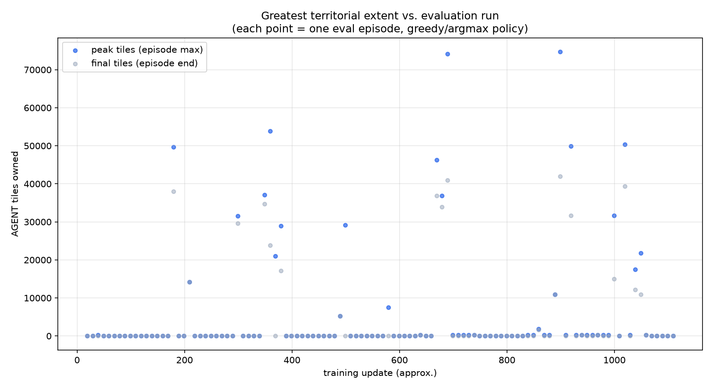
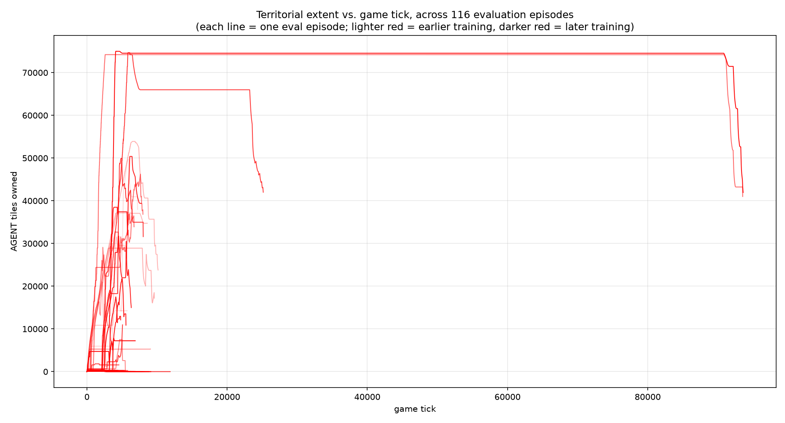
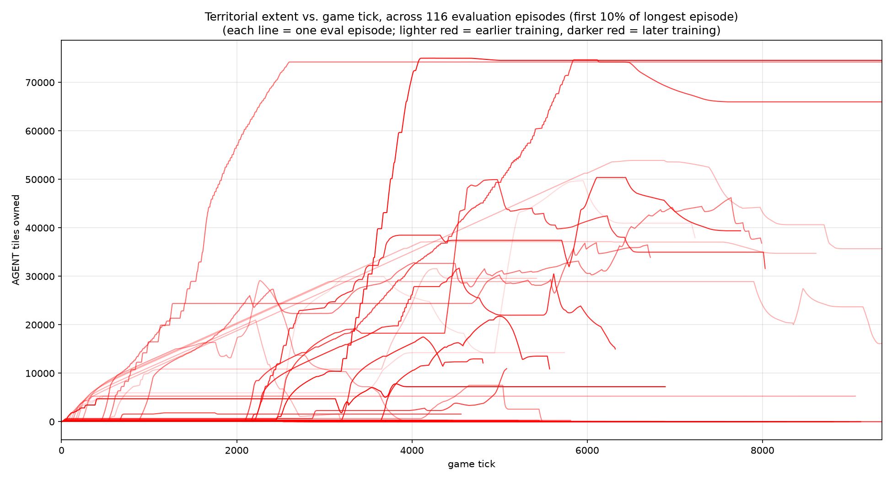
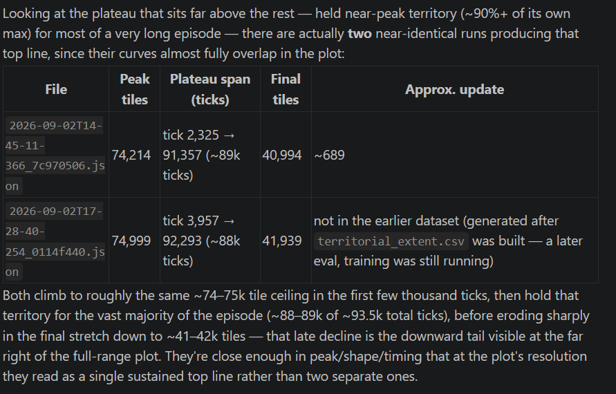

# Analysis #1

The chart shows a noisy, bursty pattern rather than steady improvement — occasional spikes to 30k-75k tiles interspersed with long stretches stuck at the ~52-tile spawn footprint — which lines up with the type-head-plateau issue we've been tracking via the type_probs diagnostic logging.

# Explain the type-head-plateau issue again? Also explain the type_probs diagnostic logging

## The type-head-plateau issue

**Background**: after adding the naval `boat_attack` action, the network's
action-type head (which picks between `noop`, `expand`, `attack_opponent`,
`boat_attack`) had to relearn preferences almost from scratch, since the
action space got bigger. Around updates 613-653 (a while back), we found it
had gotten stuck: for ~30 updates straight, the type head was sitting almost
exactly at a 50/50 split between just `noop` and `expand` — `attack_opponent`
and `boat_attack` probabilities were reading essentially 0 (partly a
legality-masking artifact, since those actions are illegal until the agent
reaches the opponent's border or has boats — but the `noop`-vs-`expand`
indifference itself was real, since both are always legal).

The telltale sign: `type_entropy` was pinned at almost exactly `ln(2) ≈
0.693` — the mathematical maximum entropy for a 2-way coin flip — with
`policy_loss` and `value_loss` both near zero. That combination meant the
network wasn't slowly learning toward `expand`; it had settled into a stable
equilibrium with essentially no gradient pressure pushing it out. This
matched the eval behavior we kept seeing: `self_tiles: 52.0` — the greedy
(argmax) policy sitting at its spawn tile the whole episode, never
expanding.

**Why it happened**: our leading hypothesis was that `entropy_coef` (0.04 at
the time) — the term that rewards the policy for staying uncertain, to
encourage exploration — was calibrated for the old 3-action network and had
gotten relatively too strong for a state where there wasn't much left to
explore between just two options. We lowered it to 0.02.

**Where it stands now**: not fully resolved, but clearly better. Looking at
the live log just now (update 1123), `type_probs` are `noop=0.55,
expand=0.36, attack_opponent=0.02, boat_attack=0.07` — a real,
non-degenerate mix, not the flat 50/50-only-two-options pattern from before.
The territorial-extent chart from a moment ago shows the same story: bursty,
inconsistent — real spikes to 30k-75k tiles mixed with stretches stuck back
at 52 — rather than a steady climb. So the plateau isn't gone, but it's not
permanently stuck either.

## The `type_probs` diagnostic logging

This is the tool we built specifically to see through a blind spot: the
training log's main `entropy` number is the **combined** type-head +
tile-head entropy (they get summed whenever `boat_attack` is sampled — see
`network.py`'s `evaluate_actions()`). The tile head can range up to
`ln(1024)` (32×32 possible boat targets), so it can dominate that combined
number and make the type head's own behavior invisible — a healthy-looking
aggregate entropy could hide a type head that's still just flipping a coin
between `noop` and `expand`.

`ActorCritic.type_diagnostics()` (`network.py`) fixes that by running a
separate, decoupled forward pass that only looks at the type head: it
returns the mean probability of each of the 4 action types across a batch of
states, plus that head's own entropy — completely independent of whatever
the tile head is doing. `train.py` calls this once per update (reusing the
same post-rollout batch already computed for the value bootstrap, so it's a
free extra forward pass, not extra environment interaction), and
prints/logs it as `type_probs[noop=... expand=... attack_opponent=...
boat_attack=...] type_entropy=...` alongside the usual stats — that's the
line read from `train_log.csv`'s `type_prob_*` columns above.

## Why might it spend a long time at the beginning of the match doing nothing, only to suddenly spring into action as the opponent gets threatening?

A few genuinely plausible reasons for that pattern, given how this agent is
trained — worth stating upfront that these are hypotheses about an emergent
correlation, not the agent "deciding" anything strategic:

1. **The reward signal is weakest exactly when things look calm.** Reward is
   `Δ(agent_tiles − opponent_tiles) / total_land_tiles`. Early game, both
   sides are small and roughly balanced, so whatever the agent does, the
   margin barely moves — the training signal telling the network "do X
   instead of nothing" is faint and noisy. Once the opponent has grown large
   and is closing in, the same formula produces much bigger swings for the
   same actions (a large, lopsided margin is more sensitive to change), so
   the learning signal sharpens exactly when there's a threat. The network
   has had much clearer gradient evidence for "when things are dire, act"
   than for "when things are calm, act."

2. **The observation looks more decision-worthy once there's a threat.**
   Early on, the CNN sees a mostly-empty map with two tiny, similar-looking
   patches — not much to key off of. Once the opponent occupies a large,
   visually distinct chunk of the map pressing toward the agent's territory,
   that's a much stronger, more salient spatial pattern for a CNN to latch
   onto than the near-uniform early-game grid.

3. **Training experience is lopsided toward "calm" states.** Because so many
   episodes get stuck at the spawn tile for thousands of ticks (the plateau
   issue), the agent has spent a disproportionate share of its total
   training experience in low-threat, do-nothing states, and comparatively
   little in high-threat ones — which are only reached in the rarer episodes
   that broke out of the stuck pattern, or late in long ones. Less
   experience in the "calm" regime means less pressure to learn a confident
   policy there specifically.

Net effect: the policy has more reason (both in reward magnitude and in
visual salience) to be decisive when the situation is dire than when it's
ambiguous — which lines up with the type-head-plateau finding (the network
sits near-indifferent between `noop`/`expand` when nothing stands out) and
with the territorial-extent chart's bursty pattern (real action sometimes
kicks in, but not consistently early).

# Create a plot with game ticks on the x axis and terretorial extent on the y axis. Plot every evaluation run as a line on this graph (yes there will be a lot of lines, that is ok). Make earlier evaluation runs/lines a lighter red and later evaluations a darker red, (earliest run is like 1% opaque last run is 100% opaque). Put the plotting python script and any other necessary scripts in analysis/territory_as_game_progresses

# Make a second plot capturing the first 10% (with the interesting variation)

# In the terretory_progression plot, identify the run that achieved the really high terretorial extent for a long period

Looking at the plateau that sits far above the rest — held near-peak territory (~90%+ of its own max) for most of a very long episode — there are actually two near-identical runs producing that top line, since their curves almost fully overlap in the plot:

File	Peak tiles	Plateau span (ticks)	Final tiles	Approx. update
2026-09-02T14-45-11-366_7c970506.json	74,214	tick 2,325 → 91,357 (~89k ticks)	40,994	~689
2026-09-02T17-28-40-254_0114f440.json	74,999	tick 3,957 → 92,293 (~88k ticks)	41,939	not in the earlier dataset (generated after territorial_extent.csv was built — a later eval, training was still running)
Both climb to roughly the same ~74–75k tile ceiling in the first few thousand ticks, then hold that territory for the vast majority of the episode (~88–89k of ~93.5k total ticks), before eroding sharply in the final stretch down to ~41–42k tiles — that late decline is the downward tail visible at the far right of the full-range plot. They're close enough in peak/shape/timing that at the plot's resolution they read as a single sustained top line rather than two separate ones.

Check it out - this is why the agent stalls. It gets stuck on only part of the map, and we can see that in the data!!!

# Did the agent ever issue any boat_attack intents?

Checked the highest-plateau replay (2026-09-02T17-28-40-254_0114f440.json, the ~93.6k-tick episode with the long ~75k-tile plateau) directly against its raw intent log. The finding is more interesting than "boat_attack is rare":

Boat attacks were attempted constantly — 8,918 boat intents from AGENT across the episode, roughly one every 10 ticks (i.e. essentially every single decision point where it was legal), for the entire 93k-tick duration.
But 8,565 of those 8,918 (96%) target the exact same destination tile (tile ref 53480), repeated over and over, each time sending a huge share of the agent's current army (troop counts per attempt ranged from ~5k early on up to 355k, tracking roughly with whatever army size the agent had at the time).
Meanwhile territory stayed essentially flat (~75k tiles) for that entire stretch — so this isn't naval expansion happening off-camera; it's the same attack, at the same spot, over and over, producing no net territorial gain.

# Check where tile 53480 is in the onion map (upper left, bottom right etc) and also who owns it

Tile 53480 is at x=232/512 (45.3% across), y=104/512 (20.3% down) — so roughly upper-middle of the map, just left of center, well up toward the top edge (not upper-left, upper-right, or bottom — closer to top-center).

Ownership: it's water (isLand=false), and — notably — not even shore (isShore=false, meaning it doesn't border any land tile at all). It stays unowned for the entire 93,611-tick episode; water tiles are never owned in this engine.

That changes the diagnosis again, in a useful way. The dst field the agent repeatedly sent (53480) isn't literally the landing point — per TransportShipUtils.ts's targetTransportTile(), the engine treats whatever tile the intent names as a reference point, then computes closestReachableShore(owner(ref), attacker, ref) to find the actual coastal landing tile nearest that reference. So sending dst=53480 over and over is really the agent saying "land near this fixed open-water point" 8,565 times in a row — the engine resolves that reference to whatever the closest reachable enemy/neutral shore is, which (since the reference point itself never moves and its owner context — TerraNullius, since it's water — never changes) plausibly resolves to the same real coastal target every single time.

# Check if the player's troop count ever actually fluctuates? It may be sending the boat to that tile and then the boat goes back to its own terretory, resulting in nothing happening. Check this possiblity

the boat never gets built at all.

transportShipUnitCount was 0 at every single sampled tick, including the final tick of the whole 93,611-tick game. The agent never had a single active Transport Ship the entire episode, despite issuing 8,918 boat_attack intents.
Troop count never drops after a boat intent — it only ever goes up (natural population regrowth), tick after tick, exactly matching the pre-intent trajectory. No deduction, no cost, nothing happens.
The warning log confirms why: essentially every boat intent hits TransportShipExecution.ts:111-116 — targetTransportTile() returns null ("cannot find target tile"), and the execution bails out before buildUnit() is ever called (that's the line that would actually spend troops and spawn the ship). So this isn't a failed invasion or a retreat — it's rejected at the very first validation step, every time.
Root cause: tile 53480 (and the handful of other targets used earlier in the episode — 127240, 135448, 102664, etc.) are resolved from macro-cells that our boatTargetMacroMaskB64 heuristic marks as "legal" but aren't actually reachable-shore targets under the engine's real closestReachableShore() check. That's the exact gap the code comments already flagged (EnvServer.ts's "cheap heuristic... not the real canBuildTransportShip check... an illegal-but-masked-legal pick is a no-op server-side") — I just hadn't confirmed how often it actually fires. In this replay, it's ~93%+ of all boat attempts.

So the plateau mechanism is now fully pinned down: the policy learned to spend a large, growing share of its action probability on boat_attack, but it's aimed at masked-legal-but-actually-invalid targets almost every time, so it's functionally a very expensive-looking no-op — no cost, but also zero effect, which is exactly why territory sits flat for tens of thousands of ticks while the intent log looks like constant naval activity.

The actionable fix is tightening the mask heuristic (or doing the real reachability check per-macro-cell, at whatever cost that adds) so boat_attack is only offered as legal when it can actually land — right now the agent is being allowed to "succeed" at an action that's silently fake.

# Now that the heuristic is fixed ...